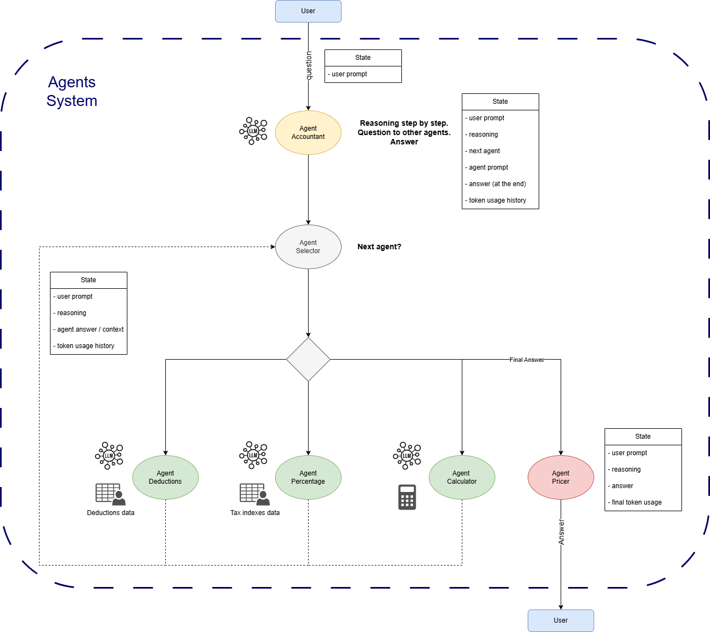
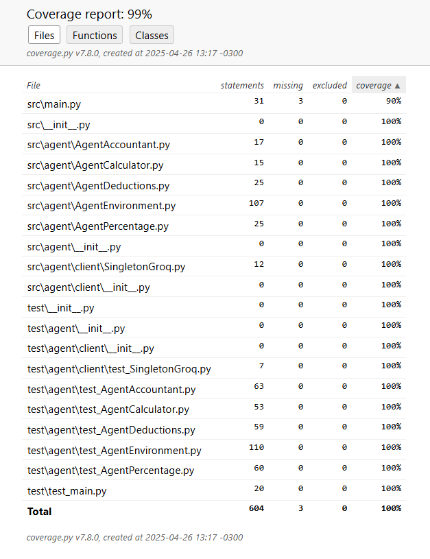

# TP3

## Description

In this TP, students are required to create an agents system that emulates reasoning to solve a complex problem.
In this implementation, a tax bot is created to answer how much tax a person has to pay. The system takes into account a
tax table and applicable deductions.
The system has 4 agents:

- Accountant: responsible to handling the main tax calculation, step by step. It calls other agents to get the
  information needed and keeps reasoning based on chat history until the final answer is reached.
- Calculator: makes math calculations.
- Deductions manager: interprets the allowed deductions from a [csv tables](./resources/deductions_data.csv) and then
  parses the user's declaration to apply only the allowed categories with the maximum allowed amounts.
- Tax table manager: interprets the tax table from a [csv tables](./resources/tax_data.csv) and then returns the
  applicable tax indexes values based on annual taxable amount.

## Requirements

- Python 3.8 or higher.
- Groq API Key for chat completion.
- langgraph for the agents orchestration.
- Streamlit for the graphical user interface.
- pytest to run the tests.
- coverage to run the coverage tests.

## Installation

1. Clone the repository:
    ```sh
    git clone https://github.com/maxit1992/MIA_PNL2.git
    cd MIA_PNL2/tp3
    ```

2. Install the dependencies:
    ```sh
    pip install -r requirements.txt
    ```

## Running the Application

To start the tax bot application, run the following command:

```sh
streamlit run src/main.py
```

This will launch the Streamlit app in your default web browser. Then you have to ask the bot how much tax you have to
pay, providing your monthly income, your expenses that may be deductible and the current month.
E.g.: "How much tax do I have to pay next month (June) if I earn 1000000, and I have spent 3000000 in rental and 1000000
in fuel? I have already paid 200000 in taxes".

## Features

- LLM with chain of thoughts to reason about the tax calculation step by step.
- Tax table configurable with a csv file.
- Deductions configurable with a csv file.

## Langgraph



## Running Tests

To run the tests, use the following command:

```sh
pytest
```

## Running Coverage

To get the code coverage, use the following command:

```sh
coverage run -m pytest
coverage report # for console output
coverage html # for html report
```

## Coverage Report



## Code Quality

No vulnerabilities or code smells were detected by SonarQube analysis.